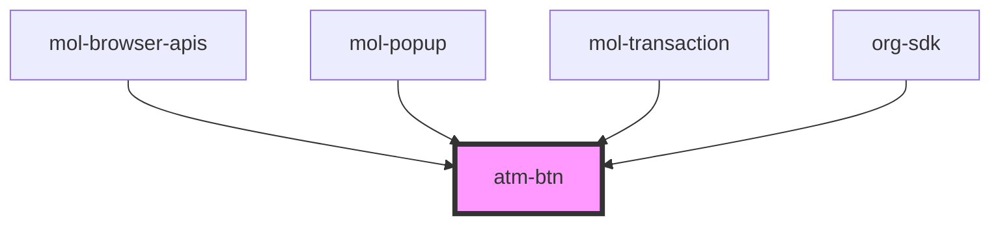

# atm-btn

<!-- Auto Generated Below -->

## Properties

| Property   | Attribute  | Description | Type      | Default     |
| ---------- | ---------- | ----------- | --------- | ----------- |
| `disabled` | `disabled` |             | `boolean` | `undefined` |

## Dependencies

### Used by

 - [mol-browser-apis](../../molecules/mol-browser-apis)
 - [mol-popup](../../molecules/mol-popup)
 - [mol-transaction](../../molecules/mol-transaction)
 - [org-sdk](../../organisms/org-sdk)

### Graph

----------------------------------------------

*Built with [StencilJS](https://stenciljs.com/)*
