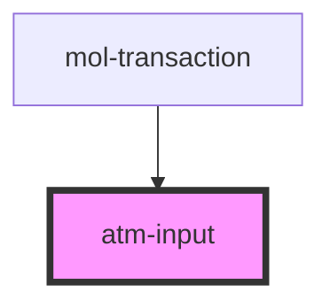

# atm-input

<!-- Auto Generated Below -->

## Properties

| Property      | Attribute     | Description | Type      | Default     |
| ------------- | ------------- | ----------- | --------- | ----------- |
| `disabled`    | `disabled`    |             | `boolean` | `undefined` |
| `placeholder` | `placeholder` |             | `string`  | `undefined` |

## Events

| Event   | Description | Type                  |
| ------- | ----------- | --------------------- |
| `entry` |             | `CustomEvent<string>` |

## Methods

### `reset() => Promise<void>`

#### Returns

Type: `Promise<void>`

## Dependencies

### Used by

 - [mol-transaction](../../molecules/mol-transaction)

### Graph

----------------------------------------------

*Built with [StencilJS](https://stenciljs.com/)*
