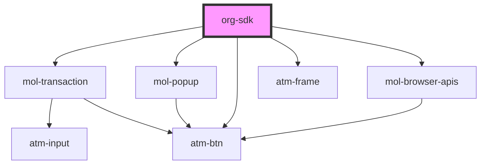

# org-sdk

<!-- Auto Generated Below -->

## Dependencies

### Depends on

- [mol-transaction](../../molecules/mol-transaction)
- [mol-popup](../../molecules/mol-popup)
- [atm-btn](../../atoms/atm-btn)
- [atm-frame](../../atoms/atm-frame)
- [mol-browser-apis](../../molecules/mol-browser-apis)

### Graph

----------------------------------------------

*Built with [StencilJS](https://stenciljs.com/)*
